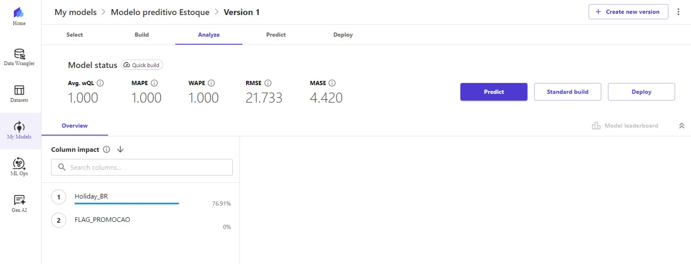

# 📊 Previsão de Estoque Inteligente na AWS com [SageMaker Canvas](https://aws.amazon.com/pt/sagemaker/canvas/)

## 🎯 Objetivos Deste Desafio de Projeto (Lab)

## 📌 Resultados

### Avaliação de Métricas do Modelo

1. **Avg. wQL (Weighted Quantile Loss)**
   - **Valor:** 1.000
   - **Descrição:** A Weighted Quantile Loss (wQL) mede a performance do modelo em prever quantis específicos da distribuição dos dados, ponderando os erros em diferentes quantis. É útil para modelos que precisam prever intervalos de confiança.
   - **Interpretação:** Um valor de 1.000 indica que o modelo não está performando bem na previsão dos quantis desejados. Um valor ideal é próximo de zero, onde um valor alto indica maior erro na previsão dos quantis.

2. **MAPE (Mean Absolute Percentage Error)**
   - **Valor:** 1.000
   - **Descrição:** MAPE mede a precisão do modelo expressando o erro absoluto como uma porcentagem das observações reais. É uma métrica útil para entender o erro relativo.
   - **Interpretação:** Um MAPE de 1.000 sugere que, em média, as previsões do modelo estão erradas por 100% em relação aos valores reais. Este é um valor muito alto, indicando que o modelo não está fornecendo previsões precisas.

3. **WAPE (Weighted Absolute Percentage Error)**
   - **Valor:** 1.000
   - **Descrição:** WAPE é similar ao MAPE, mas pondera os erros com base na importância de cada observação, fornecendo uma visão mais ajustada da precisão do modelo.
   - **Interpretação:** Um WAPE de 1.000 também indica um erro absoluto médio ponderado de 100%, reforçando que o modelo tem baixa precisão nas previsões.

4. **RMSE (Root Mean Squared Error)**
   - **Valor:** 21.733
   - **Descrição:** RMSE é a raiz quadrada da média dos quadrados dos erros. É uma métrica comum para avaliar a magnitude média dos erros de previsão.
   - **Interpretação:** O RMSE de 21.733 sugere que, em média, as previsões do modelo estão erradas por cerca de 21.733 unidades. É importante considerar a escala dos dados para interpretar se este valor é aceitável.

5. **MASE (Mean Absolute Scaled Error)**
   - **Valor:** 4.420
   - **Descrição:** MASE mede o erro absoluto médio escalado pelo erro absoluto médio de um modelo de referência, como o modelo de previsão ingênuo. Um MASE menor que 1 indica que o modelo é melhor que o modelo de referência.
   - **Interpretação:** Um MASE de 4.420 indica que o erro absoluto médio do modelo é 4.420 vezes maior que o erro absoluto médio do modelo de referência. Este valor sugere que o modelo de previsão não está performando bem em comparação com um modelo simples.

### Avaliação Geral
Com base nas métricas fornecidas:

- **Avg. wQL, MAPE, e WAPE:** Os valores de 1.000 indicam que o modelo está errando em 100% das previsões, o que é um desempenho muito ruim. Isso sugere que o modelo pode não estar capturando bem os padrões nos dados ou que há problemas com a qualidade dos dados usados para o treinamento.
- **RMSE:** Um RMSE de 21.733 indica erros significativos nas previsões. Dependendo da escala dos dados, este valor pode ser considerado alto, sugerindo a necessidade de ajustes no modelo.
- **MASE:** Um MASE de 4.420 revela que o modelo está performando muito pior que um modelo de referência simples. Isso sugere que melhorias substanciais são necessárias.

### Conclusões
Os resultados indicam que o modelo atual apresenta um desempenho fraco nas previsões de estoque.

